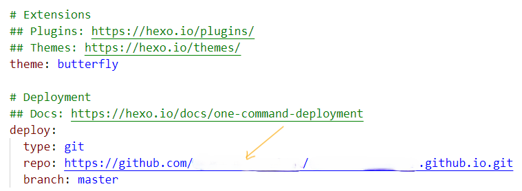

**当然是站在巨人的肩膀上！**

**因为我也没怎么学前端的知识**

------


# 大致步骤

1. 创建[github](https://github.com/)账号
2. 安装[git](https://git-scm.com/downloads),并在本地配置好相关**环境**
3. 安装[node.js](https://nodejs.org/en/),并在本地配置好相关**环境**
4. 安装[hexo](https://hexo.io/zh-cn/)框架，并在本地配置好相关**环境**
   - 运行起来网页
5. 给网页换皮肤
6. 将网页部署到[netlify](https://www.netlify.com/)上

听不懂没关系，我粘上了相关官网，可以先大致了解它们是干嘛的就可以了

# 创建github账号

简单来说，github就是一个代码托管平台，放代码的仓库

1. 去github官网用邮箱创建一个账号，并设置好账号的名字，后文用**ID**代替账号的名字，**这很重要，ID后面要用到**

2. 点击New repository，创建一个**仓库**来储存网页相关的代码

   

3. 在**Repository name***命名为**ID.github.io**,然后Create repository

   

4. 点击setting,**Repository name也**命名为**ID.github.io**


5. 点击Pages，修改Source

   

# 安装[git](https://git-scm.com/downloads),并在本地配置好相关**环境**

简单说，git就是将本地代码搬到github代码仓库的工具，也可以将代码从仓库搬到本地，当然它还有很多功能

1. 去官网下载安装，本文以windows举例

   

2. 按win键搜索，配置环境

3. 将找到安装好的git目录下cmd,按图片步骤配置到系统环境中

3. 打开git,可以在桌面或文件任意位置打开

   

4. win+R,输入cmd打开控制台输入指令，查看git的版本，成功说明git安装成功并相关环境配置也成功

   ```git
   git -v
   ```

   

# 安装[node.js](https://nodejs.org/en/),并在本地配置好相关**环境**

额，我也不懂node.js是什么，搜索吧

1. 去官网下载安装好

2. 配置好环境，找到你安装好的node.js的目录

   - 没有node_cache，node_global的话，可以自己建

   

   


3. 上面两种图都配置好了话，win+R,输入cmd打开控制台输入指令，查看node.js的版本，成功说明node.js安装成功并相关环境配置也成功

   

# 安装[hexo](https://hexo.io/zh-cn/)框架，并在本地配置好相关**环境**

页面框架有很多，建议选比较主流的，因为有比多的教学资源

1. 桌面鼠标右键，点击`Open Git Bash here`,输入命令，如果失败用管理员权限打开控制台输入命令

   

```git
npm install -g hexo-cli
```

2. 找好指定文件夹用来存放hexo框架的文件，例如用blog**空文件夹**用来存放,在改文件夹下打开`Open Git Bash here`,输入指令

   ```sql
   hexo init
   ```

   这样，hexo一些初始化文件，就部署在你指定的blog文件夹下了

   文件目录如下，我可能和初始化的目录有出入，因为我已经配置好了

   

   由于github服务器在国外，访问可能有些慢，多试几次

   - 也可能是因为github没有配置ssh连接，可以尝试配一下，搜索配置一下

3. 在blog目录下打开控制台，输入命令，启动hexo 服务

   ```cmd
   hexo s
   ```

   

​		点击http://localhost:4000/就可以本地访问部署好在本地的网站，一个很简介的页面

# 给网页换皮肤

1. 安装渲染器，在控制台界面输入

   ```git
   npm install hexo-renderer-pug hexo-renderer-stylus --save
   ```

2. 安装主题，举例安装butterfly主题

   ```git
   git clone -b master https://gitee.com/immyw/hexo-theme-butterfly.git themes/butterfly
   ```

3. 给hexo配置主题，在blog目录下找到`_config.yml`打开，更改里面的**theme**，**deploy**，**url**的设置

   - **repo**空白处填写github账号的**ID**
   - **url**空白处填写github账号的**ID**

   

   


4. 在blog目录下打开控制台输入指令，将hexo的静态页面推送到**github**上,一条一条输入

   ```git
   hexo clean
   //每次更新hexo的文件或配置时都可以用以下代码，进行更新操作，推送新代码到github上
   hexo g
   hexo d
   ```
   

# 将网页部署到[netlify](https://www.netlify.com/)上

netlify是国外的服务器访问可能有点慢，不过可以免费部署网页

1.  注册账号
2. 连接你的github账号，并将以**ID.github.io**命名的仓库部署到netlify
   - netlify会自动部署你放**ID.github.io**仓库上的静态页面，尽管静态页面在后面更新时发生了变化

3. netlify提供自定义域名，以后可以用更改的域名访问自己的网站，带.netlify.app后缀的域名

# 参考网站

https://pdpeng.github.io/2022/01/19/setup-personal-blog/

https://hexo.io/zh-cn/docs/configuration

https://butterfly.js.org/

非常感谢他们的分享！

也可以看看文章中提到过的官网文档，我个人觉得他们官方文档挺难看懂的，但是它们会指明方向

# 自己遇到过的bug

1. windows在配置环境时，生效缓慢，可以尝试重启

2. 在typora粘贴图片后，部署网站时，图片不显示

3. git的bug,git branch查看分支时没有分支，git branch new_name_branch创建分支时又失败,简称消失的分支，或者叫分支的幻读

   ```git
   //先
   git init 
   git add .
   git commit
   //再使用查看分支，没有再创建分支
   git brach
   ```

4. netlify国内访问速度差

5. 有时必须用管理员权限打开控制台才能有权限执行npm指令，能不能不用管理员权限就能打开

6. 如何在文件夹页面快速打开管理员权限的控制台页面，并且命令是在本文件目录下

# 后续提升

1. 边缘服务器cdn加速网站访问
2. 买域名，用国内dns域名解析加速网站访问
3. 在服务器部署动态页面，融入数据库

# 总结

很早之前就想试一下博客了，但是想着自己有管理知识的平台了，好像也没什么必要，好奇心驱使下还是试了试，非常感谢在搭博客时，提供帮助的网站和网友们，非常非常非常感谢！！！
按文章部署网站肯定还是会遇到些问题，多搜，以搜养搜，如果文章有错误的话，十分抱歉！

补充：今天不想debug


